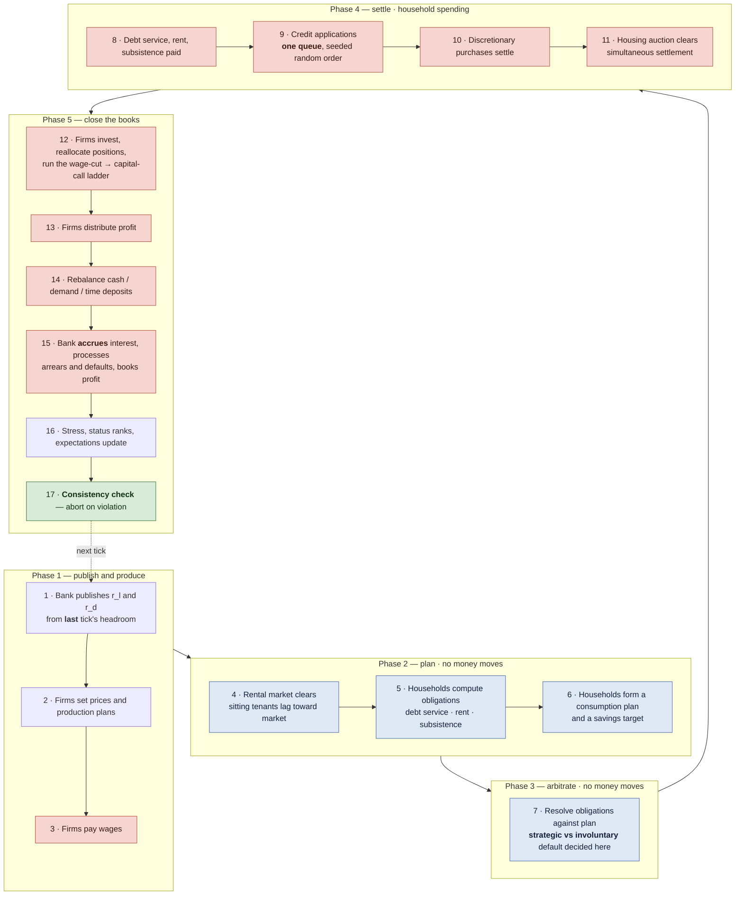
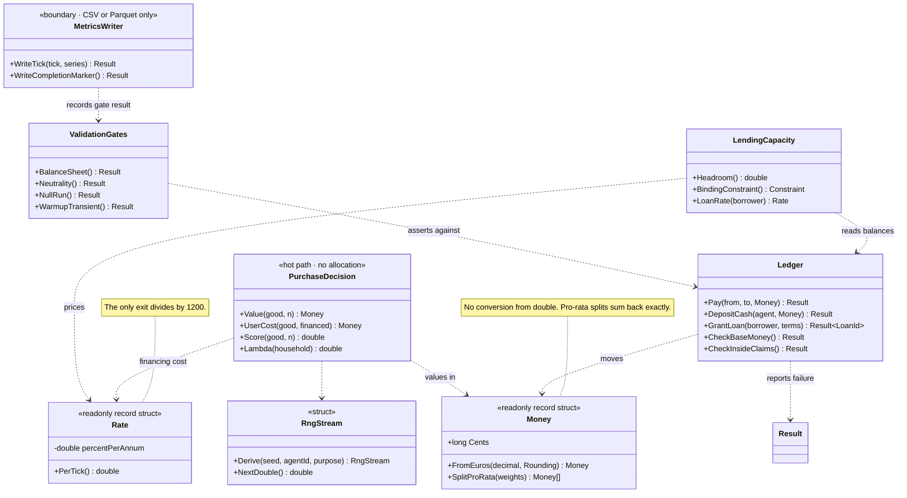
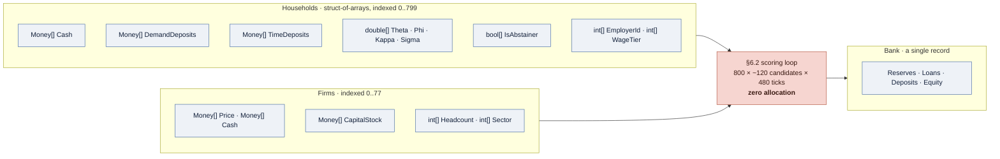
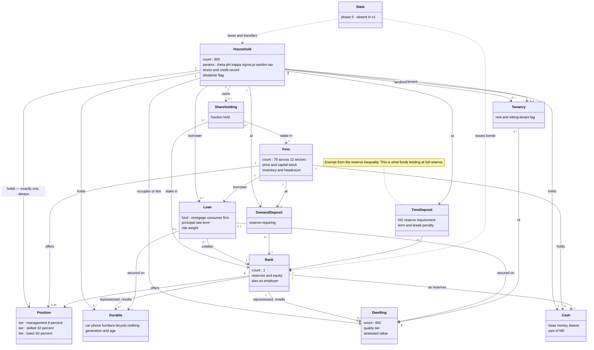
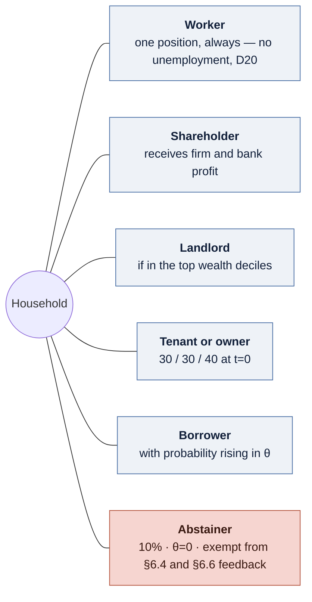

# Diagrams

Four views of the model and the engine. All are Mermaid, so they render on GitHub, in Obsidian and
in most editors without a toolchain, and they diff as text.

`§` refers to a section of [`MODEL.md`](MODEL.md); `D<n>` to [`DECISIONS.md`](DECISIONS.md);
story ids to [`../stories/`](../stories/).

1. [The tick](#1-the-tick) — the pipeline, and which phases move money
2. [Value types and service boundaries](#2-value-types-and-service-boundaries) — the only class diagram that earns its place
3. [Data layout](#3-data-layout) — why there is almost no object graph to draw
4. [Every entity in the simulation](#4-every-entity-in-the-simulation) — the domain model

---

## 1. The tick

§6.1, seventeen steps in five phases, following a **plan → arbitrate → settle** structure. Nothing
is paid until every claim on a household's income is known, because the choice between paying debt
service and consuming (§6.8) cannot be made before both amounts exist.

**Read the shading carefully.** It is tempting to say "money moves in phase 4", and that is false:
wages are paid at step 3 in phase 1, and phase 5 settles capital calls, dividends, rebalancing and
interest. The genuinely quiet phases are **2 and 3** — that is the invariant story 04-05 tests.



Four orderings in that diagram were defects found in review rather than design intentions, and each
is load-bearing:

| Ordering | Why |
|---|---|
| Rates at step 1 use **last** tick's headroom | The bank discovers its reserve position only after the tick settles at step 14. It cannot see the future, and neither should the code |
| Rent set at step 4, **before** obligations at step 5 | §6.5 replaced the fixed-yield rule and §6.1 had no step to run the replacement in — the two sections each assumed the other did it, with 40% of the town renting |
| Accrual at step 15 on balances **after** step 8 | Payment and accrual are separate operations on the same loan. Treating both as interest is the standard double-counting error |
| Capital call at step 12, **after** wages | Otherwise a shareholder who is also the firm's employee is asked to fund the wage he has not yet received |

---

## 2. Value types and service boundaries

The only class diagram worth drawing, because it is where the type system carries the argument from
D27: the four defect classes both reviews kept producing are turned into build failures here.



Note what is deliberately absent. `Result` appears at the boundaries — the ledger, the writer, the
gates — and **not** inside `PurchaseDecision`, because nothing on that path can fail for a domain
reason and `Result<T>` allocates (story 01-04). A bad value there is a defect, not an outcome.

---

## 3. Data layout

There is almost no object graph in this engine, and that is a decision rather than an omission:
`LANGUAGE-CHOICE.md` §7 commits to agents as **integer indices into flat parallel arrays**. Cache
locality is most of the measured gap between the compiled languages, and retrofitting it after E5
would mean rewriting the hot loop.

So the interesting structure is not "which class points at which" but "which columns does the tick
walk".



An agent is an **integer**, not a reference. A household does not hold a pointer to its employer; it
holds `EmployerId`, and the firm's data is `firms.Price[employerId]`. The same applies to loans,
shares and tenancies, which are records carrying integer ids on both sides.

```
Household 0    Household 1    Household 2   …      ← what an object graph would give you
[cash|dep|θ|φ] [cash|dep|θ|φ] [cash|dep|θ|φ]         (a pointer chase per field)

Cash        [ h0 | h1 | h2 | h3 | … | h799 ]      ← what this engine uses
Deposits    [ h0 | h1 | h2 | h3 | … | h799 ]         (one contiguous sweep per column)
Theta       [ h0 | h1 | h2 | h3 | … | h799 ]
```

If someone later "tidies" this into a `Household` class, the benchmark gate in story 05-07 is what
should catch it.

---

## 4. Every entity in the simulation

The domain model: every agent, every real asset, and every claim that connects them. Multiplicities
are the defaults from §13.



### The twelve sectors

`Firm` is one type with a sector field, not twelve subclasses. **This town has no imports**, so it
must produce everything it consumes — its clothing, electronics, furniture and car firms are makers,
not shops, and are correspondingly large (§13.6).

| Sector | Firms | Positions | Notes |
|---|---|---|---|
| Food | 12 | ~120 | |
| Clothing | 6 | ~84 | |
| Electronics | 4 | ~80 | Obsolescence; 24-month replacement cycle |
| Furniture | 4 | ~56 | |
| Bicycles | 3 | ~9 | |
| Cars | 4 | ~110 | Running cost; second-largest financed purchase |
| **Public transport** | 1 | ~25 | Capacity-limited, not elastic. The transport numéraire |
| Restaurants | 16 | ~120 | |
| Personal services | 14 | ~42 | |
| Leisure / holidays | 7 | ~35 | **The collinearity breaker** — financeable, durability 1 (§1.3) |
| **Rental firm** | 1 | ~4 | Holds 35% of rented stock |
| Construction | 6 | ~99 | **Two products**: dwellings, and capacity for other firms |
| **Bank** | 1 | 12 | The 79th employer |
| **Total** | **79** | **~796** | Scaled by the loader to exactly 800 |

### What a household can be at once

There is no `Person` hierarchy. One `Household` record carries every role simultaneously, and the
combination is what makes the distributional questions answerable:



**This overlap is exactly why the headline result has to be decomposed** (§1.2, story 10-03). An
abstainer is also a wage earner, a shareholder, possibly a landlord and possibly a bank employee —
so under D21 more credit in the town raises his income a year later, while raising the prices he
pays. The two channels run in opposite directions, and reporting real consumption alone would mix
them.

### Entities deliberately absent

| Not modelled | Consequence |
|---|---|
| Unemployment (D20) | Income shocks run through demotion only; default rates are conservative |
| Firm failure (D22) | No insolvency wave, no fire sale — the model cannot produce a crash |
| Intermediate goods (D22) | Wages are the whole of marginal cost |
| A second bank | Inflates C4, the interest-to-income share, by construction |
| Demography, inheritance | Cannot show how housing wealth concentrates across generations (B21) |
| Cooperative/municipal landlords | ~10% of German rental stock is cost-priced; rents here are more market-responsive than reality |
| An equity market price (D16) | The model can say nothing about asset-price inflation in shares |
