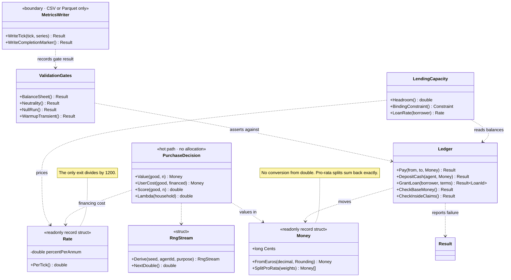
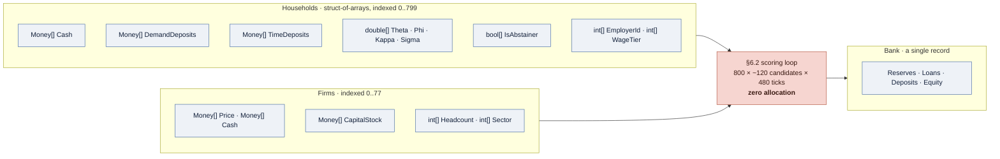
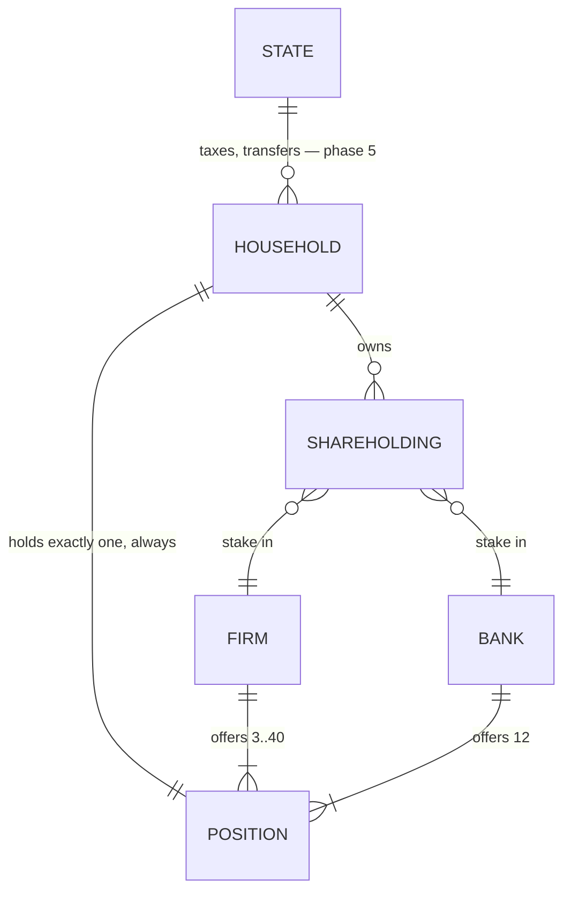
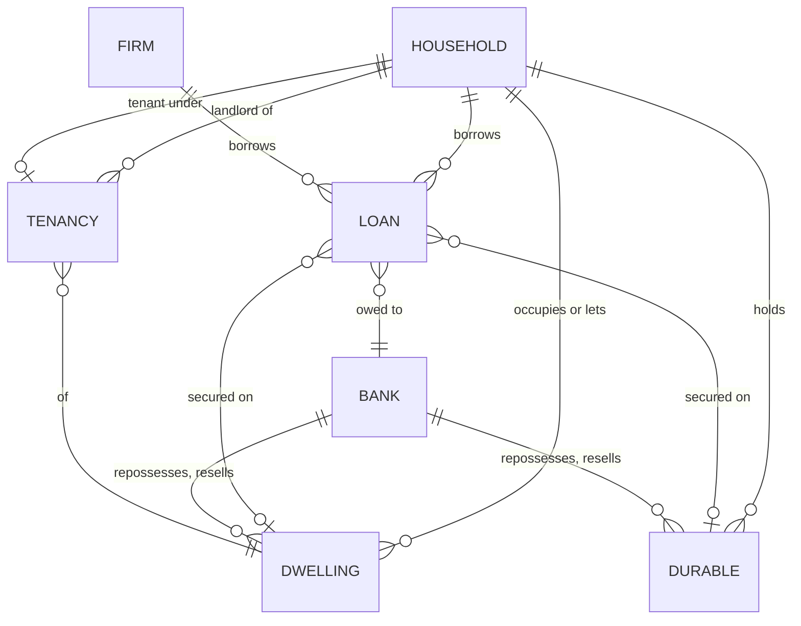
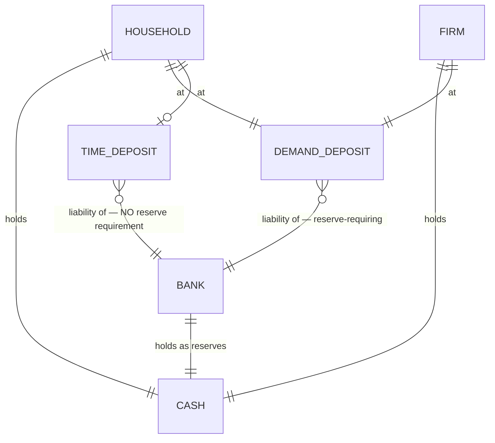
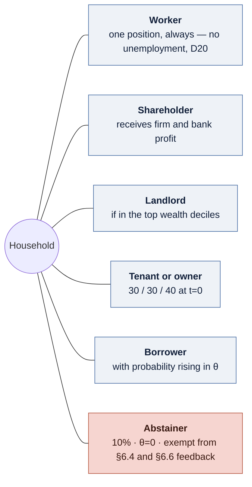

# Diagrams

Four views of the model and the engine. All are Mermaid, so they render on GitHub, in Obsidian and
in most editors without a toolchain, and they diff as text.

`§` refers to a section of [`MODEL.md`](MODEL-draft.md); `D<n>` to [`DECISIONS.md`](DECISIONS-draft.md);
story ids to [`../stories/`](stories/).

## Checking these before committing

Mermaid that *parses* is not Mermaid that *reads*, and the difference is not visible in a diff.
Both diagrams in the first version of this file were wrong in ways only rendering revealed: the
tick laid its phases out as 4, 5, 1, 2, 3 — because a `next tick` back-edge made the graph cyclic
and Mermaid broke the cycle wherever it liked — and the entity diagram was a single 13-class
tangle with a floating note and an orphaned edge label.

So: **render every block and look at it.** The toolchain is 15 seconds to install and needs no
Chromium download, since a system Chrome already satisfies Puppeteer.

```sh
export PUPPETEER_SKIP_DOWNLOAD=true
npm install @mermaid-js/mermaid-cli
printf '{"executablePath": "%s", "args": ["--no-sandbox"]}' "$(command -v google-chrome)" > pc.json

# parse + render every fenced block; one output file per diagram
npx mmdc -i docs/DIAGRAMS.md -o out.md -p pc.json -e png -w 1600 --scale 2
```

Three things to check, in order:

1. **It renders at all.** A syntax error fails the command and names the block.
2. **The dimensions are sane.** A block that comes back a few hundred pixels tall has collapsed —
   `direction TB` inside a subgraph is silently ignored when cross-subgraph edges are present, which
   flattened an `LR` version of the tick into a 3168×104 strip.
3. **It reads.** Open the PNGs. This is the only step that catches wrong ordering, colliding labels
   and tangles, and it is the step that is easy to skip.

Known constraints, learned the hard way: a `note` belongs *outside* a class body as
`note for X "…"`, never inside it; a cyclic flowchart has no defined starting point, so a
"return to start" edge must be a terminal node rather than a real edge; and a `classDiagram` past
roughly ten boxes will tangle, which is why section 4 is three diagrams rather than one.

---

1. [The tick](#1-the-tick) — the pipeline, and which phases move money
2. [Value types and service boundaries](#2-value-types-and-service-boundaries) — the only class diagram that earns its place
3. [Data layout](#3-data-layout) — why there is almost no object graph to draw
4. [Every entity in the simulation](#4-every-entity-in-the-simulation) — the domain model

---

## 1. The tick

§6.1, seventeen steps in five phases, following a **plan → arbitrate → settle** structure. Nothing
is paid until every claim on a household's income is known, because the choice between paying debt
service and consuming (§6.8) cannot be made before both amounts exist.

It lays out tall because seventeen sequential steps are tall. Read top to bottom.

**Read the shading carefully.** It is tempting to say "money moves in phase 4", and that is false:
wages are paid at step 3 in phase 1, and phase 5 settles capital calls, dividends, rebalancing and
interest. The genuinely quiet phases are **2 and 3** — that is the invariant story 04-05 tests.

```mermaid
flowchart TD
    subgraph P1["Phase 1 — publish and produce"]
        S1["1 · Bank publishes r_l and r_d<br/>from <b>last</b> tick's headroom"]
        S2["2 · Firms set prices and production plans"]
        S3["3 · Firms pay wages"]
        S1 --> S2 --> S3
    end
    subgraph P2["Phase 2 — plan · no money moves"]
        S4["4 · Rental market clears<br/>sitting tenants lag toward market"]
        S5["5 · Households compute obligations<br/>debt service · rent · subsistence"]
        S6["6 · Households form a consumption plan<br/>and a savings target"]
        S4 --> S5 --> S6
    end
    subgraph P3["Phase 3 — arbitrate · no money moves"]
        S7["7 · Resolve obligations against plan<br/><b>strategic vs involuntary</b> default decided here"]
    end
    subgraph P4["Phase 4 — settle · household spending"]
        S8["8 · Debt service, rent, subsistence paid"]
        S9["9 · Credit applications<br/><b>one queue</b>, seeded random order"]
        S10["10 · Discretionary purchases settle"]
        S11["11 · Housing auction clears<br/>simultaneous settlement"]
        S8 --> S9 --> S10 --> S11
    end
    subgraph P5["Phase 5 — close the books"]
        S12["12 · Firms invest, reallocate positions,<br/>run the wage-cut → capital-call ladder"]
        S13["13 · Firms at their <b>year end</b><br/>distribute profit — annual, staggered"]
        S14["14 · Rebalance cash / demand / time deposits"]
        S15["15 · Bank <b>accrues</b> interest, processes<br/>arrears and defaults, books profit"]
        S16["16 · Stress, status ranks, expectations update"]
        S17["17 · <b>Consistency check</b> — abort on violation"]
        S12 --> S13 --> S14 --> S15 --> S16 --> S17
    end
    S3 --> S4
    S6 --> S7
    S7 --> S8
    S11 --> S12
    S17 --> NEXT["↻ next tick — return to step 1"]

    classDef moves fill:#f6d5d0,stroke:#b4553f,color:#3a1a12
    classDef quiet fill:#dfe8f5,stroke:#4a6fa5,color:#12203a
    classDef gate  fill:#d8ead8,stroke:#3f7d3f,color:#123312
    class S3,S8,S9,S10,S11,S12,S13,S14,S15 moves
    class S4,S5,S6,S7 quiet
    class S17 gate
```



Four orderings in that diagram were defects found in review rather than design intentions, and each
is load-bearing:

| Ordering | Why |
|---|---|
| Rates at step 1 use **last** tick's headroom | The bank discovers its reserve position only after the tick settles at step 14. It cannot see the future, and neither should the code |
| Rent set at step 4, **before** obligations at step 5 | §6.5 replaced the fixed-yield rule and §6.1 had no step to run the replacement in — the two sections each assumed the other did it, with 40% of the town renting |
| Accrual at step 15 on balances **after** step 8 | Payment and accrual are separate operations on the same loan. Treating both as interest is the standard double-counting error |
| Capital call at step 12, **after** wages | Otherwise a shareholder who is also the firm's employee is asked to fund the wage he has not yet received |

---

## 2. Value types and service boundaries

The only class diagram worth drawing, because it is where the type system carries the argument from
D27: the four defect classes both reviews kept producing are turned into build failures here.



Note what is deliberately absent. `Result` appears at the boundaries — the ledger, the writer, the
gates — and **not** inside `PurchaseDecision`, because nothing on that path can fail for a domain
reason and `Result<T>` allocates (story 01-04). A bad value there is a defect, not an outcome.

---

## 3. Data layout

There is almost no object graph in this engine, and that is a decision rather than an omission:
`LANGUAGE-CHOICE.md` §7 commits to agents as **integer indices into flat parallel arrays**. Cache
locality is most of the measured gap between the compiled languages, and retrofitting it after E5
would mean rewriting the hot loop.

So the interesting structure is not "which class points at which" but "which columns does the tick
walk".



An agent is an **integer**, not a reference. A household does not hold a pointer to its employer; it
holds `EmployerId`, and the firm's data is `firms.Price[employerId]`. The same applies to loans,
shares and tenancies, which are records carrying integer ids on both sides.

```
Household 0    Household 1    Household 2   …      ← what an object graph would give you
[cash|dep|θ|φ] [cash|dep|θ|φ] [cash|dep|θ|φ]         (a pointer chase per field)

Cash        [ h0 | h1 | h2 | h3 | … | h799 ]      ← what this engine uses
Deposits    [ h0 | h1 | h2 | h3 | … | h799 ]         (one contiguous sweep per column)
Theta       [ h0 | h1 | h2 | h3 | … | h799 ]
```

If someone later "tidies" this into a `Household` class, the benchmark gate in story 05-07 is what
should catch it.

---

## 4. Every entity in the simulation

Every agent, every real asset and every claim that connects them, across **three views**. One
diagram containing all thirteen entities was drawn first and rejected: it rendered, but as a
tangle of edges sweeping the full width, with a floating note and an orphaned label. Three
readable views beat one complete-but-unreadable one.

Multiplicities are the defaults from §13. Full attributes are in the table after the third view.

### 4a · Agents and employment



`HOUSEHOLD ||--|| POSITION` is an **identity, not an aspiration**: total positions equal
`n_households` exactly, and story 09-06's reallocation pool must be empty at the end of every tick.
There is no unemployment (D20), so demotion between tiers is the model's only income shock.

The bank appears here twice over — as an employer of twelve, and as something owned through the
same `SHAREHOLDING` register as any firm. It is not a special case.

### 4b · Real assets and the claims on them



The two `BANK` edges to `DWELLING` and `DURABLE` are the repossession path (§5.3.1, story 07-08),
and they are why a loan must carry its collateral rather than only its balance: risk weight depends
on current LTV, which depends on what the collateral is currently worth.

A household appears on **both** ends of `TENANCY`. The same population contains landlords and
tenants, which is what makes the rental market a distributional channel rather than a cost.

### 4c · Money



This is the whole of V1: `M0 = household cash + firm cash + bank reserves`, exact to the cent,
every tick. The three `CASH` edges are the three places base money can sit, and firm cash is in the
identity because an earlier draft of it omitted them.

**The asymmetry between the two deposit classes is the most consequential thing in this diagram.**
Demand deposits require reserves; time deposits do not, because the saver has genuinely given up
the use of the money. That exemption is what allows lending at `reserve_ratio = 1.0` at all —
without it the full-reserve control run is determined by the size of its opening loan book rather
than by credit appetite (§7.1.1, story 06-06).

### Entity reference

| Entity | Count | Key fields |
|---|---|---|
| `Household` | 800 | θ φ κ σ π ε τ · stress · credit record · abstainer flag |
| `Firm` | 78 across 12 sectors | price · capital stock · inventory · headcount |
| `Bank` | 1 | reserves · equity · loan book · also an employer |
| `State` | 0 in v1 | phase 5 only |
| `Dwelling` | 850 | quality tier · assessed value |
| `Durable` | many | car, phone, furniture, bicycle, clothing · generation · age |
| `Position` | 800 | tier: management 8% / skilled 32% / basic 60% |
| `Shareholding` | many | fraction held |
| `Loan` | many | mortgage / consumer / firm · principal · rate · term · risk weight |
| `Tenancy` | ~320 | rent · sitting-tenant lag |
| `Cash` | — | base money, bearer, part of `M0` |
| `DemandDeposit` | — | reserve-requiring |
| `TimeDeposit` | — | term · break penalty · **no reserve requirement** |

### The twelve sectors

`Firm` is one type with a sector field, not twelve subclasses. **This town has no imports**, so it
must produce everything it consumes — its clothing, electronics, furniture and car firms are makers,
not shops, and are correspondingly large (§13.6).

| Sector | Firms | Positions | Notes |
|---|---|---|---|
| Food | 12 | ~120 | |
| Clothing | 6 | ~84 | |
| Electronics | 4 | ~80 | Obsolescence; 24-month replacement cycle |
| Furniture | 4 | ~56 | |
| Bicycles | 3 | ~9 | |
| Cars | 4 | ~110 | Running cost; second-largest financed purchase |
| **Public transport** | 1 | ~25 | Capacity-limited, not elastic. The transport numéraire |
| Restaurants | 16 | ~120 | |
| Personal services | 14 | ~42 | |
| Leisure / holidays | 7 | ~35 | **The collinearity breaker** — financeable, durability 1 (§1.3) |
| **Rental firm** | 1 | ~4 | Holds 35% of rented stock |
| Construction | 6 | ~99 | **Two products**: dwellings, and capacity for other firms |
| **Bank** | 1 | 12 | The 79th employer |
| **Total** | **79** | **~796** | Scaled by the loader to exactly 800 |

### What a household can be at once

There is no `Person` hierarchy. One `Household` record carries every role simultaneously, and the
combination is what makes the distributional questions answerable:



**This overlap is exactly why the headline result has to be decomposed** (§1.2, story 10-03). An
abstainer is also a wage earner, a shareholder, possibly a landlord and possibly a bank employee —
so under D21 more credit in the town raises his income a year later, while raising the prices he
pays. The two channels run in opposite directions, and reporting real consumption alone would mix
them.

### Entities deliberately absent

| Not modelled | Consequence |
|---|---|
| Unemployment (D20) | Income shocks run through demotion only; default rates are conservative |
| Firm failure (D22) | No insolvency wave, no fire sale — the model cannot produce a crash |
| Intermediate goods (D22) | Wages are the whole of marginal cost |
| A second bank | Inflates C4, the interest-to-income share, by construction |
| Demography, inheritance | Cannot show how housing wealth concentrates across generations (B21) |
| Cooperative/municipal landlords | ~10% of German rental stock is cost-priced; rents here are more market-responsive than reality |
| An equity market price (D16) | The model can say nothing about asset-price inflation in shares |
